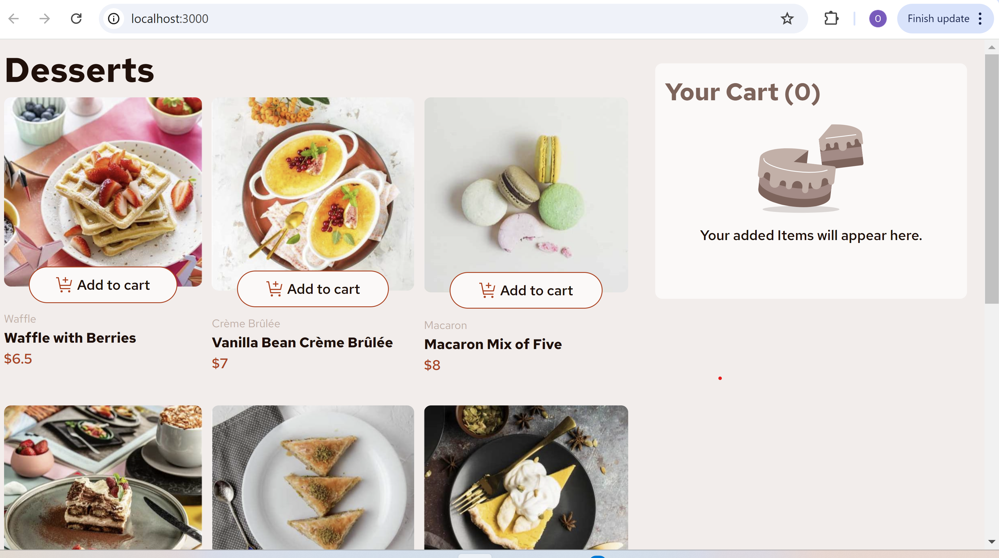

# Frontend Mentor - Product list with cart solution

My First ever frontend mentor challenge solution. Challenge difficulty ranked Junior.
This is a solution to the [Product list with cart challenge on Frontend Mentor](https://www.frontendmentor.io/challenges/product-list-with-cart-5MmqLVAp_d). Frontend Mentor challenges help you improve your coding skills by building realistic projects.

## Table of contents

- [Overview](#overview)
  - [The challenge](#the-challenge)
  - [Screenshot](#screenshot)
  <!-- - [Links](#links) -->
- [My process](#my-process)
  - [Built with](#built-with)
  - [What I learned](#what-i-learned)

## Overview

### The challenge

Users should be able to:

- Add items to the cart and remove them
- Increase/decrease the number of items in the cart
- See an order confirmation modal when they click "Confirm Order"
- Reset their selections when they click "Start New Order"
- View the optimal layout for the interface depending on their device's screen size
- See hover and focus states for all interactive elements on the page

### Screenshot

<!-- ### Links -->

<!-- - Solution URL: [Add solution URL here](https://your-solution-url.com) -->
<!-- - Live Site URL: [Add live site URL here](https://your-live-site-url.com) -->

## My process

### Built with

- HTML
- CSS
- Bootstrap
- React- JS library
- TypeScript

### What I learned

I tried to use this project to get familiar with the frontend mentor platform. I also wanted to work on my typescript.
I learnt how to pass data between components and maintain consistent state.
